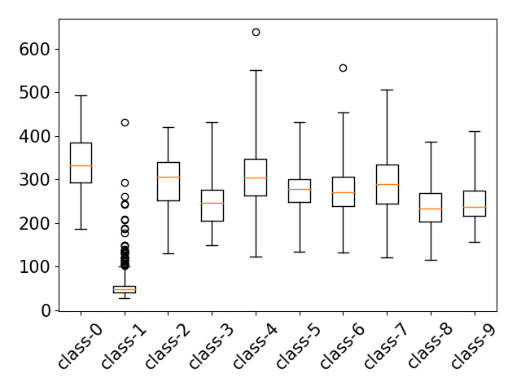
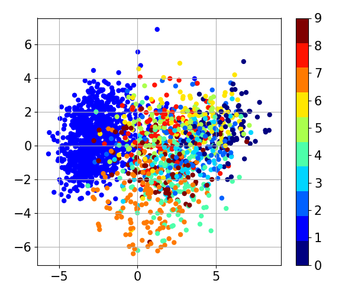
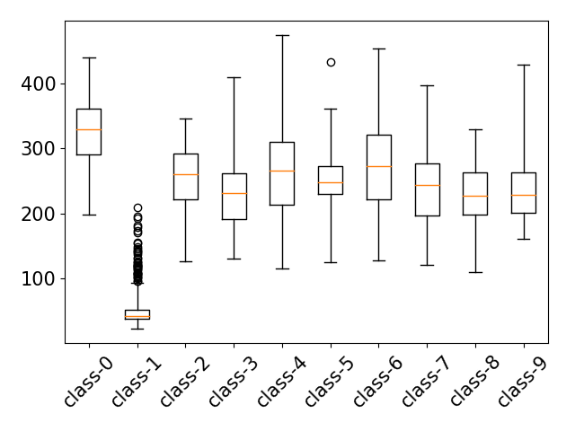

[PyTorch] Anomaly Detection using Convolutional Variational Auto-Encoder (CVAE)
=====

Example of Anomaly Detection using Convolutional Variational Auto-Encoder (CVAE) [<a href="https://github.com/YeongHyeon/CVAE-AnomalyDetection">TensorFlow 1.x</a>] [<a href="https://github.com/YeongHyeon/CVAE-AnomalyDetection-TF2">TensorFlow 2.x</a>].

## Architecture

    
  
Simplified VAE architecture.

## Problem Definition

    
  
'Class-1' is defined as normal and the others are defined as abnormal.

## Results

### Training

    
  
Restoration result by CVAE.

  
  
Latent vector space of training set, and reconstruction result of latent space walking.

### Test
#### z_dim = 2

      
  
Left figure shows latent vector space of test set. Right figure shows box plot with restoration loss of test procedure.

#### z_dim = 128

  
  
Latent vector space of test set, box plot with restoration loss, and histogram of restoration loss.

## Environment
* Python 3.7.4  
* PyTorch 1.1.0   
* Numpy 1.17.1  
* Matplotlib 3.1.1  
* Scikit Learn (sklearn) 0.21.3  

## Reference
[1] Kingma, D. P., & Welling, M. (2013). <a href="https://arxiv.org/abs/1312.6114">Auto-encoding variational bayes</a>. arXiv preprint arXiv:1312.6114.  
[2] <a href="https://en.wikipedia.org/wiki/Kullback%E2%80%93Leibler_divergence">Kullback Leibler divergence</a>. Wikipedia
